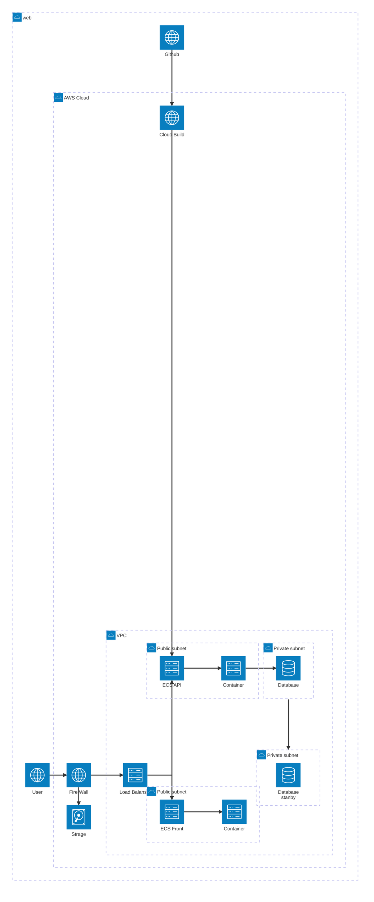

# インフラ

```mermaid
architecture-beta
    group web(cloud)[web]
    group aws(cloud)[AWS Cloud] in web
    group vpc(cloud)[VPC] in aws

    group public_api1(cloud)[Public subnet] in vpc
    group public_api2(cloud)[Public subnet] in vpc
    group private_api1(cloud)[Private subnet] in vpc
    group private_api2(cloud)[Private subnet] in vpc

    service user(internet)[User] in web
    service github(internet)[Github] in web

    service cloud_build(internet)[Cloud Build] in aws

    service front(internet)[Fire Wall] in aws
    service alb(server)[Load Balanser] in vpc

		service strage(disk)[Strage] in aws
    service ecs_front(server)[ECS Front] in public_api1
    service container_front(server)[Container] in public_api1

    service ecs_api(server)[ECS API] in public_api2
    service container_api(server)[Container] in public_api2

    service db1(database)[Database] in private_api1
    service db2(database)[Database stanby] in private_api2

    junction junction1

    user:R --> L:front

    github:B --> T:cloud_build
    cloud_build:B --> T:ecs_api

    front:B --> T:strage
    front:R --> L:alb
    alb:R -- L:junction1
    junction1:T --> B:ecs_api
    junction1:B --> T:ecs_front
    ecs_front:R --> L:container_front
    ecs_api:R --> L:container_api
    container_api:R --> L:db1
    db1{group}:B --> T:db2{group}
```
